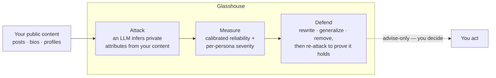
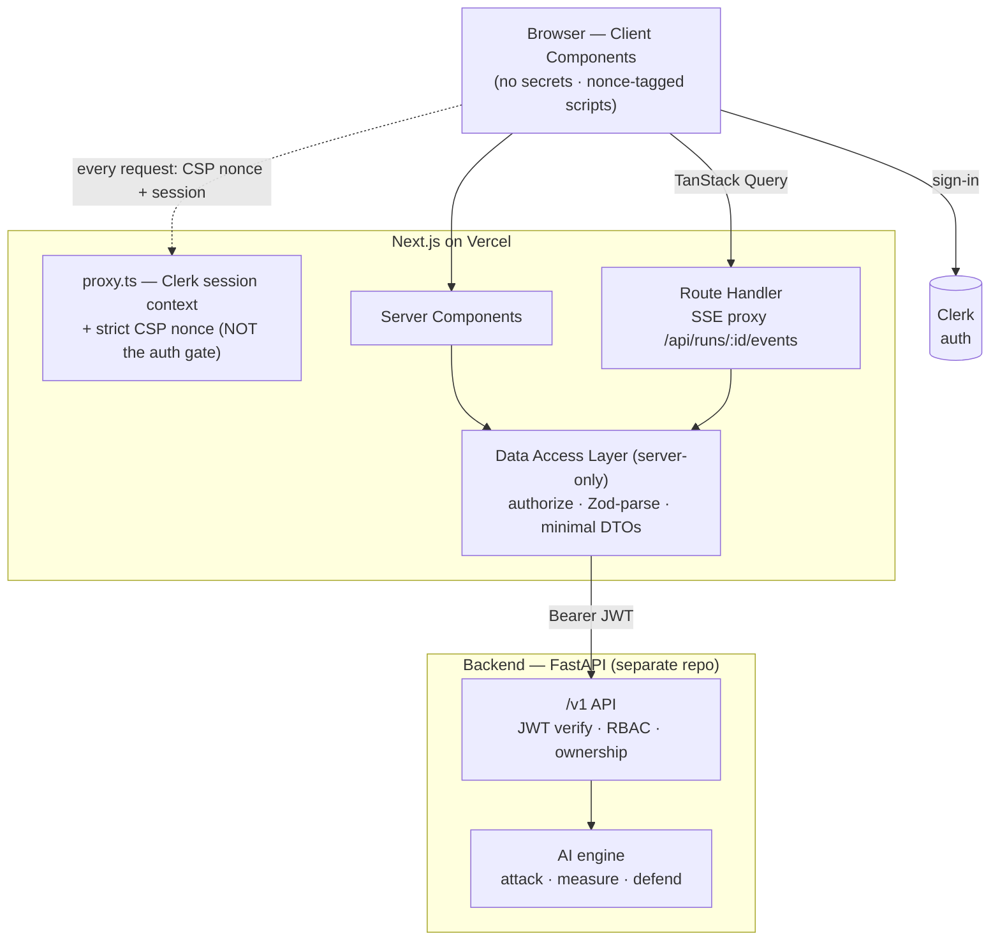

# Glasshouse — Frontend

[](https://glasshouse-frontend.vercel.app/) [](https://github.com/Aditya-gam/glasshouse-frontend/actions/workflows/ci.yml)  

Next.js frontend for **Glasshouse** (privacy self-audit: **Attack → Measure → Defend**). Part of the
[glasshouse](https://github.com/Aditya-gam/glasshouse) project — the spec (`docs/`) and the UI prototype
live in the hub repo.

**Stack:** Next.js 16 (App Router) · TypeScript strict · pnpm · Tailwind v4 · shadcn/ui · Lucide ·
TanStack Query · generated OpenAPI client (`@hey-api/openapi-ts`) + Zod at the boundary · OpenTelemetry.

## How it works

Glasshouse shows you your privacy exposure the way an adversary would — then helps you close it.
Every recommendation is **advise-only**: it never posts or changes anything on your behalf.



## Architecture

The trust boundary is simple: **everything sensitive stays server-side.** Client Components hold
no secrets; the server-only Data Access Layer is the one place that authorizes requests, talks to
the backend, and returns minimal DTOs. See the [ADRs](docs/adr/) for the reasoning.



## Prerequisites

- **Node 24** (Active LTS) — `nvm use` reads [`.nvmrc`](.nvmrc).
- **pnpm** — `corepack enable` (the version is pinned via `packageManager` in `package.json`).

## Getting started

```bash
nvm use            # Node 24
corepack enable    # pnpm
pnpm install
pnpm dev           # http://localhost:3000
```

Copy [`.env.example`](.env.example) to `.env.local` for Clerk auth + the backend URL. Screens render
on fixtures without a backend, so a running API is only needed to exercise the live-data paths.

An interactive **API reference** (Scalar) is served at [`/docs`](https://glasshouse-frontend.vercel.app/docs),
rendered from the vendored [`openapi/openapi.json`](openapi/openapi.json) — no backend needed.

## Scripts

| Script                         | Purpose                                             |
| ------------------------------ | --------------------------------------------------- |
| `pnpm dev`                     | Dev server (Turbopack).                             |
| `pnpm build`                   | Production build.                                   |
| `pnpm typecheck`               | `tsc --noEmit` (strict).                            |
| `pnpm lint`                    | ESLint (flat config, `eslint-config-next`).         |
| `pnpm test` / `test:run`       | Vitest + RTL + MSW (watch / once).                  |
| `pnpm test:coverage`           | Vitest with coverage (lcov → SonarCloud).           |
| `pnpm test:e2e`                | Playwright E2E — a11y, journeys, keyboard, CSP.     |
| `pnpm format` / `format:check` | Prettier write / check.                             |
| `pnpm spec:pull`               | Refresh the vendored OpenAPI spec from the backend. |
| `pnpm api:generate`            | Regenerate the typed client (`@hey-api`).           |
| `pnpm analyze`                 | Bundle treemap (`@next/bundle-analyzer`).           |
| `pnpm size`                    | Bundle-size budget (size-limit).                    |

A husky `pre-commit` hook runs `lint-staged` (ESLint `--fix` + Prettier on staged files). CI runs
the full gate set — see [Testing](#testing) below.

## Security & privacy

This is a privacy product, so the security posture is part of the product:

- **Auth boundary in the DAL, not middleware** — `proxy.ts` is callback-free (Clerk session
  context only); authorization is enforced in `lib/dal/*` and re-verified by the backend, which
  survives the 2025 `x-middleware-subrequest` bypass CVE. ([ADR 0001](docs/adr/0001-auth-in-dal-not-middleware.md))
- **Strict nonce CSP** — `script-src` is nonce + `strict-dynamic` (no effective `unsafe-inline`),
  enforced in production, alongside HSTS, `X-Frame-Options: DENY`, `Referrer-Policy`,
  `Permissions-Policy`, and `Cross-Origin-Opener-Policy`. ([ADR 0002](docs/adr/0002-clerk-managed-strict-csp.md))
- **No secrets client-side** — only `NEXT_PUBLIC_*` reach the browser; everything sensitive stays
  in the server-only DAL. Supply chain: Dependabot + a blocking `pnpm audit` gate.
- **HONEST-UI invariants** — calibrated reliability (never raw confidence), no-false-safety on
  Defend, decoy off-by-default → opt-in → per-use confirm, advise-only CTAs, a persona lens that
  reorders-never-hides, WCAG AA + full keyboard operability (incl. a skip link).

## Testing

A testing-trophy shape — static types plus a thick integration layer:

- **Unit / integration** — Vitest + React Testing Library + MSW (components, the DAL, route handlers).
- **Property-based** — fast-check over the severity / ordering domain invariants.
- **E2E (Playwright)** — real-browser WCAG-AA axe sweep (light + dark), critical-path journeys,
  **keyboard-only** operability, and a **CSP-violation** guard.
- **CI gates** — `tsc` + ESLint + Prettier · OpenAPI client drift-guard · bundle-size budget
  (size-limit) · `pnpm audit` · Semgrep · CodeQL · SonarCloud (quality + coverage) · the Playwright suite.

## Deploy (Vercel)

Deployed on **Vercel** via native Git integration — every PR gets a preview URL and `main` deploys to
production. The repo is **zero-config**: Vercel auto-detects Next.js, picks Node 24 from
`engines` in `package.json` and pnpm from `packageManager`, so no `vercel.json` is needed.

**One-time setup (Vercel dashboard):**

1. **Add New → Project → Import** `Aditya-gam/glasshouse-frontend`. The **Next.js** preset is detected;
   leave the build/install commands as detected (`next build` / `pnpm install`).
2. Add the environment variables below for **Production** and **Preview**.
3. Deploy. PRs then build preview URLs automatically.

**Environment variables** (contract in [`.env.example`](.env.example)):

| Variable                                                          | Secret? | Notes                                                                                      |
| ----------------------------------------------------------------- | ------- | ------------------------------------------------------------------------------------------ |
| `NEXT_PUBLIC_CLERK_PUBLISHABLE_KEY`                               | no      | Clerk instance — must **match** the instance the backend verifies JWTs against.            |
| `CLERK_SECRET_KEY`                                                | **yes** | Clerk secret; server-only.                                                                 |
| `NEXT_PUBLIC_API_BASE_URL`                                        | no      | Deployed backend URL. Until the backend is deployed, live-data paths fall to 501/fixtures. |
| `NEXT_PUBLIC_CLERK_SIGN_IN_URL` / `…_SIGN_UP_URL`                 | no      | `/sign-in` · `/sign-up`.                                                                   |
| `NEXT_PUBLIC_CLERK_SIGN_IN_FALLBACK_REDIRECT_URL` / `…_SIGN_UP_…` | no      | `/`.                                                                                       |
| `DEV_USER_ID`                                                     | **yes** | Dev-only `X-Dev-User-Id` fallback; leave **unset** in production (fail-closed).            |

> **Clerk instance:** use the shared **dev** instance for previews now (it must match the backend);
> migrating to a Clerk **production** instance is a later coordinated change with the backend. Auth is
> enforced in the DAL + backend, not middleware — see [`.claude/rules/frontend.md`](.claude/rules/frontend.md).

## Project structure

```
app/            App Router — routes + route-local _components/; app/api/ (server-side SSE proxy) · app/docs/ (Scalar API reference)
components/     Shared — ui/ (shadcn primitives) + app-shell, attribute, providers
lib/            dal/ (server-only data access) · api/ (generated client + Zod) · mocks/ (MSW) · fixtures/
e2e/            Playwright — a11y sweep · journeys · keyboard · CSP guard
docs/adr/       Architecture Decision Records (MADR)
proxy.ts        Clerk session context + strict CSP nonce (NOT the auth boundary — enforcement is in the DAL)
next.config.ts  Static security headers + bundle analyzer
*.test.ts(x)    Vitest + RTL + MSW, colocated next to source
instrumentation.ts   OpenTelemetry registration
```

> **Status:** Frontend feature-complete on fixtures and hardened — all 7 screens, Clerk auth +
> server-only DAL + generated client + live-data wiring (the `runs` path), comprehensive tests
> (Vitest/RTL/MSW + Playwright a11y/keyboard/CSP + property-based), an enforced strict CSP +
> security headers, supply-chain + bundle-size gates, and Vercel CI/CD — all on `main`.
> Per-endpoint live screen-swaps land as the backend ships `/v1/inferences`, `/v1/eval/*`,
> `/v1/remediations`. Build order is tracked in the hub's `docs/11-roadmap/tasks-frontend.md`.
